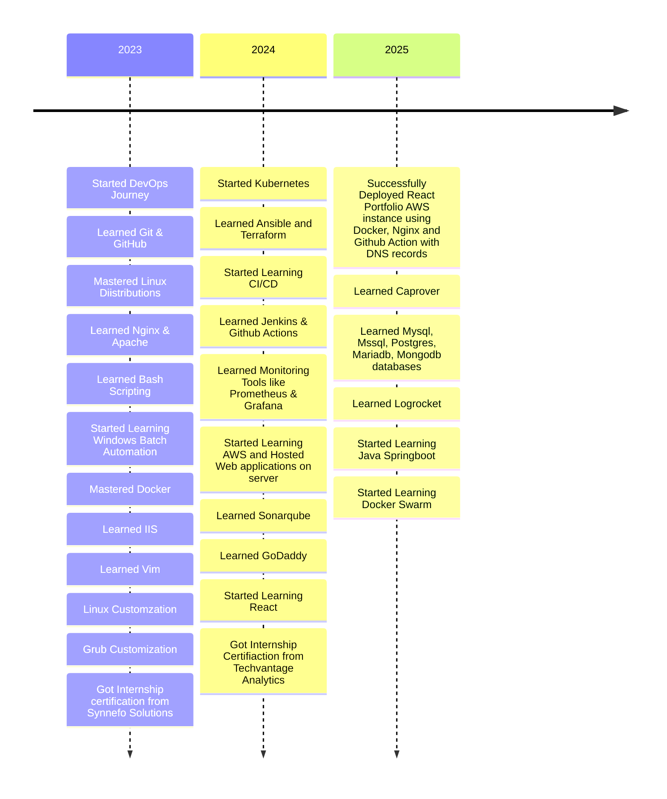

# `{ About Me }`

## `{ GitHub Trophies 🏆 }`

 
  

  

## `{ Socials }`

  
  
  
  

## `{ Tech Stack }`

### `< Programming Languages />`

  
  
  
  
  
  
  
  
  
  
  
  

### `< Version Control & CI/CD />`

  
  
  
  

### `< Cloud & Hosting />`

  
  
  
  
  

### `< Databases />`

  
  
  
  
  
  

### `< Web Servers & Services />`

  
  
  

### `< Operating Systems />`

  
  
  
  
  
  
  

### `< Containerization & Orchestration />`

  
  
  
  

### `< Monitoring & Logging />`

  
  
  

### `< Tools & Utilities />`

  
  
  
  
  
  

### `< Miscellaneous />`

  
  
  
  
  
  
  
  

 

 

## <b> Github Stats </b>
<!-- Copy-paste in your Readme.md file -->

  

 

 

## `{ Learning Journey }`

## `{ Docker Status: Life Edition }`

➜ docker ps -a
CONTAINER ID    NAME                   STATUS
CoffeeEmpty     brain_function        Paused (Need refill)
BugFactory      my_code               Continuously Restarting
C0D3BR0K3N     debugger              Exit (127) No clue why
L33tC0d3r      expectations          Created (but never started)
N0CL0CK        work_life_balance     Exited (255) Not Found
DEADLINE       motivation            Health: 2/100 (Critical)
YEET123        documentation         Removed (was never there)
ST4CK0FLOW     actual_knowledge      Running (2% CPU, 98% Stack Overflow)

➜ docker ps -a --format "table {{.Names}}\t{{.Status}}"
CONTAINER NAME          STATUS
-----------------      ------------------------------------------
my_dreams              Stopped (waiting for salary credit)
social_life            Exited (0) 36 months ago
sleep_schedule         CrashLoopBackoff: Insomnia detected
code_quality           Image corrupted: Friday deploy
rubber_duck           Running (debugging in progress)
github_commits        Error: Message "will fix later" repeated 100 times
weekend_plans         Container deleted by production issues
mental_stability      Resource limits exceeded: Too many meetings

➜ docker inspect life-exe
[
  {
    "Id": "404",
    "Created": "Too long ago",
    "Path": "/dev/null",
    "Args": ["--need-coffee", "--more-coffee", "--sleep=false"],
    "State": {
      "Status": "Questioning life choices",
      "Running": true,
      "Paused": false,
      "Restarting": true,
      "Dead": false,
      "Pid": 404,
      "ExitCode": "Coffee not found",
      "Error": "Task failed successfully"
    },
    "Mounts": [
      {
        "Source": "coffee_machine",
        "Destination": "mouth",
        "Mode": "continuous"
      }
    ]
  }
]

➜ docker stats
CONTAINER       CPU%     MEM%        NET I/O
caffeine        98%      Critical    2MB/1TB
bugs_fixed      0.01%    Error       404B/∞
meetings        90%      ZZZ         0B/0B
procrastinate   100%     Maximum     ∞/0B
stackoverflow   999%     Overload    9TB/1KB

➜ docker events
2024-01-15 09:00:00 Container brain_exe: Low coffee warning
2024-01-15 10:00:00 Container focus: Failed to start
2024-01-15 11:00:00 Container bugs: Multiplying unexpectedly
2024-01-15 12:00:00 Container lunch: Interrupted by meetings
2024-01-15 13:00:00 Container deadlines: Approaching critically
2024-01-15 15:00:00 Container coffee: Emergency refill required
2024-01-15 16:00:00 Container todo_list: Stack overflow error
2024-01-15 17:00:00 System: Automatic shutdown imminent

➜ docker network ls
NETWORK ID      NAME                DRIVER      SCOPE
404notfound     social_life         bridge      unreachable
caffeine        brain_network       overlay     local
sleep           dream_network       bridge      disconnected
stackoverflow   knowledge_base      overlay     global
